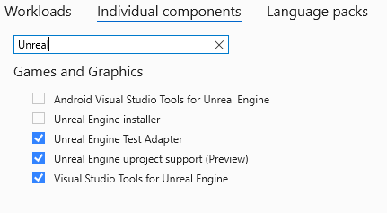
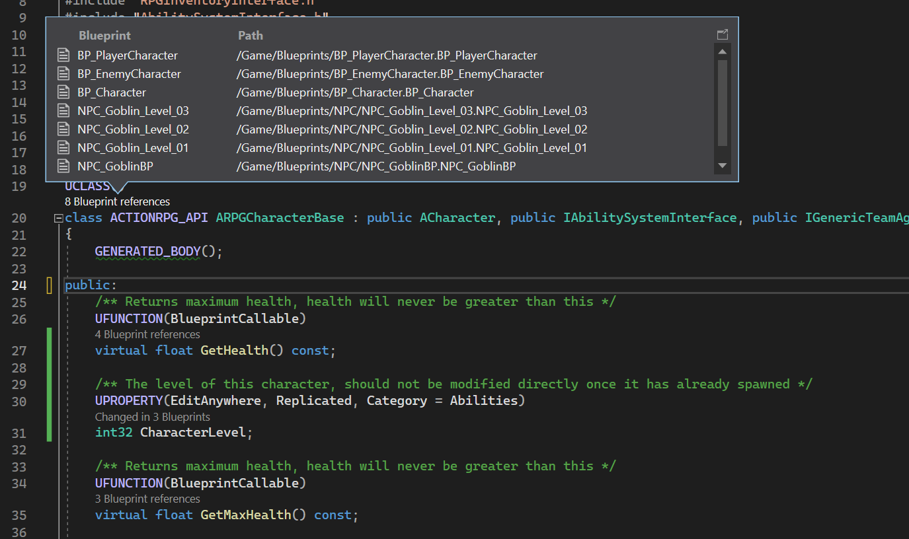
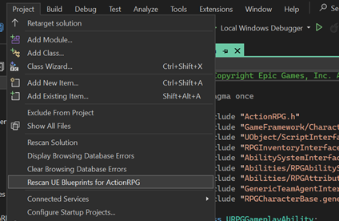

# Visual Studio Integration Tool

Visual Studio Integration Tool is an Unreal Engine plugin that works in conjunction with Visual Studio to display information about Blueprints assets in C++ code (requires Visual Studio 2022 17.4 or later).

## Installing

### Visual Studio

The tool requires the `IDE support for Unreal Engine` component from Visual Studio to be installed. You can find it under the "Game development with C++" workload in the Visual Studio Installer (figure 1).

 \
*Figure 1 - Installing the Visual Studio component*

### Unreal Engine
  You can install the plugin in a couple of ways:

 - Through the Epic Games Launcher:
  - Select the "Install to Engine" option within the Launcher. From there, you can select an engine version for installation.
     - If you're using the Marketplace website, you can add the plugin to your account and you will have an option to open the Launcher in order to install it as detailed above.
     - If you already added the plugin to your account, go Library -> Vault in the and locate the plugin there.

 - Through source distribution:
     - If you're unable to use the Marketplace-based distribution (e.g. you're building the Unreal Engine from source), then you can install the plugin manually by following the instructions found at <https://github.com/microsoft/vc-ue-extensions#readme>

## Enabling the plugin

- Through the Unreal Editor
  - Open your project and then use the Plugin Manager to enable "VisualStudioTools".
  - See [official documentation](https://docs.unrealengine.com/INT/working-with-plugins-in-unreal-engine/) for more information on how to install and enable plugins.
- (Advanced) Alternatively, you can manually edit the '.uproject' descriptor for your project and add an entry for the "VisualStudioTools" plugin.

## Usage

Blueprints Integration in Visual Studio 2022

1. Begin by installing and enabling the Blueprints Integration plugin.
2. Open your solution in Visual Studio.
3. You should now be able to see [Code Lens hints][codelens] with Blueprints references when opening files that contain `UCLASS` macros.
4. Click on the Code Lens to show a pop-up that will display your Blueprint information. (figure 1)
5. You can find the logs from the plugin execution in the Output Window.
6. To refresh your blueprint information in the IDE, you can select the "Rescan UE Blueprint for \<project\>" option under the “Project” menu. (figure 2)

 \
*Figure 2 - Code Lens showing blueprints that derive from a UEClass*

 \
*Figure 3 - Menu to rescan the blueprint assets in the game project*

[codelens]: https://learn.microsoft.com/en-us/visualstudio/ide/find-code-changes-and-other-history-with-codelens?view=vs-2022

## Troubleshooting

If you encounter any issues when setting up Visual Studio in conjunction with the Unreal Editor plugin, please refer to the [Troubleshooting](https://github.com/microsoft/vc-ue-extensions/blob/main/Docs/Troubleshooting.md) guide in the repository. This guide provides solutions for common issues and is periodically updated to ensure that the latest solutions are available.

## Reporting issues

To report new issues, provide feedback, or request new features, please use the following options: [Report a Problem](https://aka.ms/feedback/cpp/unrealengine/report) and [Suggest a Feature](https://aka.ms/feedback/cpp/unrealengine/suggest). These options will allow you to submit your issue or feedback directly to our team and help us improve the plugin moving forward.