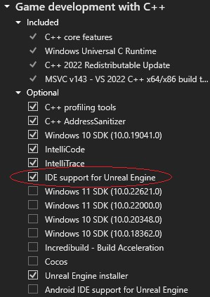

# Visual Studio Integration Tool

The Visual Studio Integration Tool is a plugin that enables deep integration with Visual Studio 2022. This tool is required to display Blueprints information in Visual Studio (requires Visual Studio 2022 17.4 or later).

## Installing

### Visual Studio

The tool requires the `IDE support for Unreal Engine` component from Visual Studio to be installed. You can find it under the "Game Development with C++" workload in the VS Installer (figure 1).

 \
*Figure 1 - Installing the Visual Studio component*

### Unreal Engine

- Via the Marketplace in the Epic Games Launcher
  - Use the "Install to Engine" option at the top and select with engine version to use.
  - If using Marketplace web site, you can add the plugin to your account and there should be an option to open the Launcher to install using the flow above.
- Via source distribution
  - In some scenarios, like building Unreal Engine from source, Marketplace-based distribution might not be available to you. In these cases, you can install the plugin manually following the instructions at <https://github.com/microsoft/vc-ue-extensions#readme>

## Enabling the plugin

- Using the Unreal Editor
  - Open your project and then use the Plugin Manager to enable "VisualStudioTools".
  - See [official documentation](https://docs.unrealengine.com/INT/working-with-plugins-in-unreal-engine/) for more information on how to install and enable plugins.
- (Advanced) Manually edit the '.uproject' descriptor for your project and add an entry for the "VisualStudioTools" plugin.

## Usage

Blueprints Integration in Visual Studio

- Once the plugin is installed and enabled, open your solution in Visual Studio
- When opening a file containing `UCLASS` macros, you will see [Code Lens hints][codelens] with the Blueprints derived from that class.
- Click the Code Lens to display a pop-up that shows your Blueprint information (figure 1).
- The Output Window will display the Unreal Engine logs from the plugin execution.
- To refresh the blueprint information in the IDE (e.g., after making asset changes in the Unreal Editor, or fixing an error in the plugin execution), you can use the "Rescan UE Blueprint for \<project\>" option under the “Project” menu (figure 2).

 \
*Figure 2 - Code Lens showing blueprints that derive from a UEClass*

 \
*Figure 3 - Menu to rescan the blueprint assets in the game project*

[codelens]: https://learn.microsoft.com/en-us/visualstudio/ide/find-code-changes-and-other-history-with-codelens?view=vs-2022

## Reporting issues

In case you hit any issues using the tool, we have collected some common troubleshooting steps in our [GitHub repository](https://github.com/microsoft/vc-ue-extensions/blob/main/Docs/troubleshooting.md). We are updating that guide based on feedback from customers.

You can report issues, provide feedback and request features using one of the following options:

- Using the following Visual Studio Developer Community links: [Report a Problem](https://aka.ms/feedback/cpp/unrealengine/report) and [Suggest a Feature](https://aka.ms/feedback/cpp/unrealengine/suggest).
  - This is our **prefered mechanism**. It routes the feedback directly to our team, where we can request more information if needed, and allows the community to track the status of existent feedback.
- In Visual Studio, via the "Help > Send Feedback" menu.
- Through the Questions section of the plugin's page in the Unreal Engine Marketplace.
